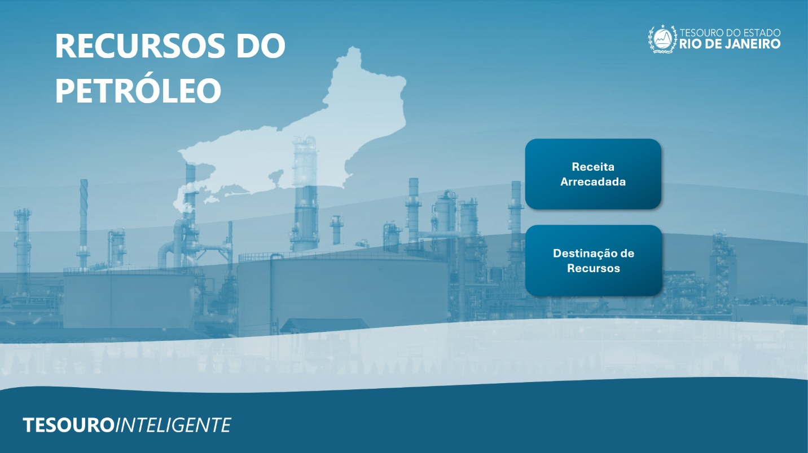
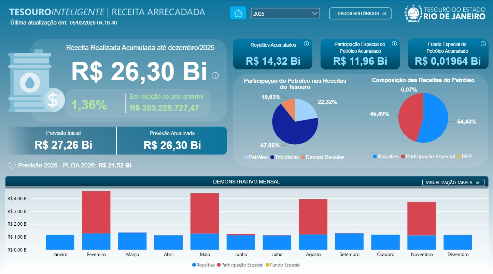
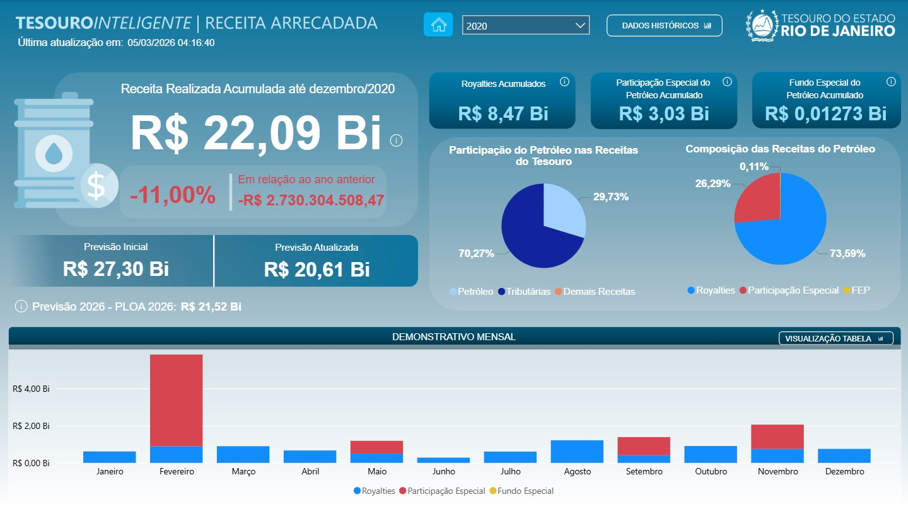
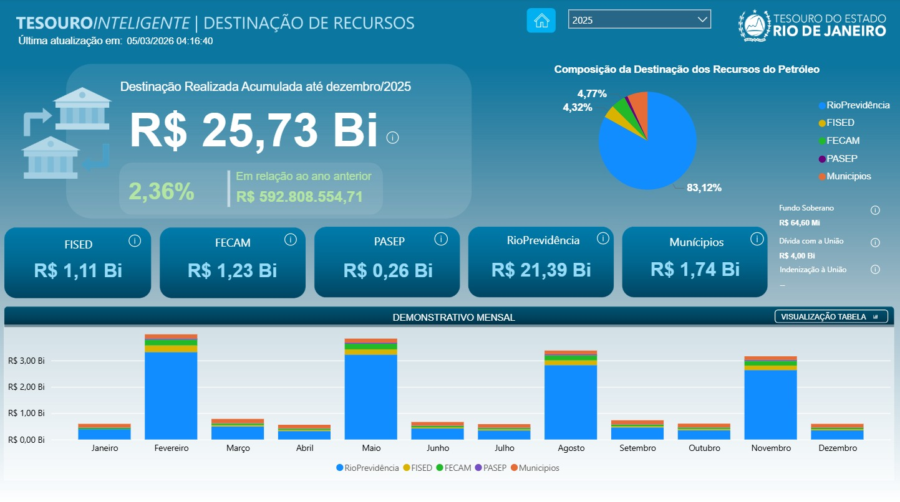
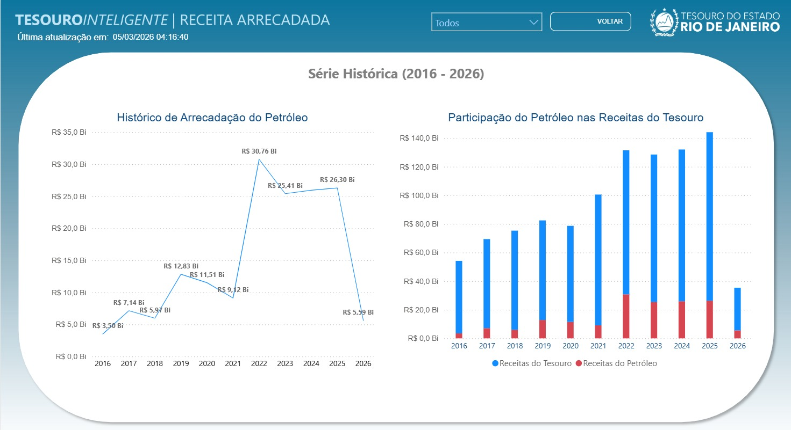
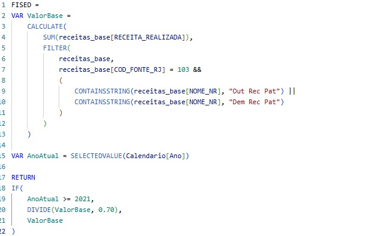

# Novo Painel do Petróleo: Receita Arrecadada e Destinação de Recursos — SEFAZ-RJ

## Contexto

Projeto institucional desenvolvido para modernizar a análise de receitas petrolíferas e da destinação de recursos do Tesouro do Estado do Rio de Janeiro.

A iniciativa teve como objetivo substituir o painel anteriormente utilizado pela secretaria, consolidando indicadores estratégicos, séries históricas de arrecadação e destinação de recursos entre 2016 e 2026, regras fiscais e métricas executivas em um ambiente analítico único para apoio à tomada de decisão.

## Meu Papel

Atuei como único analista de dados do projeto, sendo responsável pela condução integral das atividades analíticas e pelo desenvolvimento da solução de ponta a ponta.

Minhas responsabilidades incluíram:

- Levantamento e refinamento de requisitos junto aos stakeholders
- Extração, tratamento e validação de dados utilizando SQL
- Modelagem analítica e estruturação das bases de dados
- Desenvolvimento de métricas e regras de negócio em DAX
- Construção dos dashboards no Power BI
- Desenvolvimento de recursos de UX voltados à interpretação dos indicadores
- Validação funcional da solução junto às áreas demandantes
- Apresentação executiva do projeto para a Subsecretária do Tesouro e demais stakeholders envolvidos

O projeto foi desenvolvido com elevado grau de autonomia, em interação direta com áreas de negócio e gestão, desde a concepção até a entrega final.

## Principais Desafios

- Tratamento de inconsistências históricas identificadas entre bases de dados e o painel legado
- Implementação de regras fiscais específicas para diferentes períodos de arrecadação
- Construção de métricas condicionais em DAX para cenários distintos de análise
- Estruturação de comparativos anuais automáticos
- Consolidação de informações provenientes de diferentes fontes institucionais
- Criação de recursos de UX para contextualização e interpretação dos indicadores executivos

## Stack

- Power BI
- SQL
- DAX
- Power Query
- Modelagem Analítica
- UX para BI

## Competências Demonstradas

- Business Intelligence
- Data Analytics
- Levantamento de requisitos
- Modelagem de dados
- SQL
- DAX
- Storytelling com dados
- Comunicação com stakeholders
- Desenvolvimento de dashboards executivos

## Dashboard Inicial

Tela de entrada e navegação do painel.

## Receita Arrecadada

Painel executivo para acompanhamento da arrecadação das receitas petrolíferas, com indicadores estratégicos, comparativos anuais e análises temporais.

## Receita Arrecadada — Cenário de 2020

Exemplo de utilização do painel para análise de um período de retração das receitas, evidenciando variações negativas e seus impactos nos indicadores de arrecadação.

## Destinação de Recursos

Painel voltado à análise da distribuição institucional dos recursos provenientes do petróleo.

## Série Histórica

Acompanhamento da evolução das receitas petrolíferas entre 2016 e 2026, permitindo análises temporais, comparativos anuais e identificação de tendências históricas de arrecadação e destinação dos recursos do petróleo.

## Implementação de Regra Fiscal em DAX

Exemplo de regra fiscal implementada para o FISED (Fundo Estadual de Investimentos e Ações de Segurança Pública e Desenvolvimento Social do Estado do Rio de Janeiro). A medida identifica receitas petrolíferas elegíveis por meio da combinação de códigos de fonte e nomenclaturas específicas, consolidando os valores destinados ao fundo. A lógica também contempla tratamentos distintos para diferentes períodos da série histórica, refletindo mudanças nas regras de contabilização das receitas ao longo do tempo. Sua implementação utilizou funções como CALCULATE, FILTER, CONTAINSSTRING e IF para traduzir regras fiscais e contábeis em indicadores analíticos consistentes.

## Indicadores de Variação

Tooltip desenvolvido para fornecer análises comparativas rápidas entre períodos.

## UX e Contextualização

Recursos desenvolvidos para ampliar a compreensão dos indicadores e facilitar a navegação dos usuários.

## Recursos Informativos

Elementos complementares de contextualização institucional incorporados à solução.

## Resultados

- Consolidação de indicadores estratégicos em um ambiente analítico único
- Projeto desenvolvido para substituir o painel anteriormente utilizado pela secretaria
- Implementação de regras fiscais e métricas especializadas
- Padronização das regras fiscais utilizadas nas análises históricas
- Estrutura preparada para atualização contínua e acompanhamento histórico
- Aprimoramento da interpretação executiva dos dados
- Redução da fragmentação de informações entre diferentes fontes institucionais
- Disponibilização de visão executiva para acompanhamento da arrecadação e destinação de recursos
- Apresentação da solução para a Subsecretária de Tesouro e stakeholders institucionais
